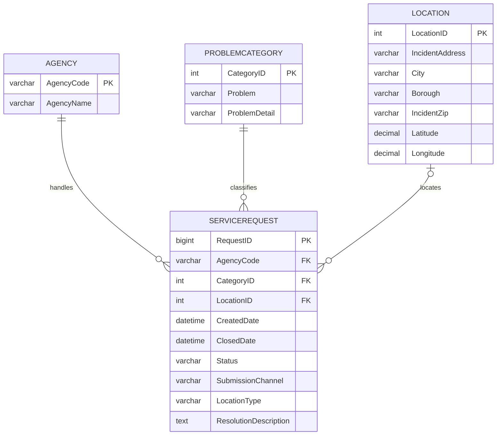

# NYC 311 Service Requests Database

DATA 201 — Database Technologies for Data Intelligence Applications  
Progress documented: October 3, 2026

## Project overview

This project converts an NYC 311 CSV file into a relational MySQL database. The main goal is to organize service requests into related tables so we can study request types, agency workload, locations, submission channels, and changes over time using SQL.

The full CSV has been imported into a staging table. We have loaded a working subset into four relational tables and verified their row counts. We decided to use approximately 2–5 million requests for this stage instead of waiting for the entire dataset to be loaded into the relational tables.

### Current verified position

| Item | Verified result |
|---|---:|
| CSV data records, excluding the header | 22,659,530 |
| Original CSV columns | 44 |
| Approximate CSV size | 14.8 GB |
| Rows in full staging table `export_full` | 22,659,530 |
| Source rows processed by the batch loader | 4,050,000 |
| New requests inserted by the batch loader | 4,050,000 |
| Earlier sample requests retained | 2,025 |
| Total relational service requests | 4,052,025 |

The staging count describes our downloaded snapshot, not the changing total on the live NYC Open Data website. The foreign-key relationship audit has been prepared, but its result has not yet been recorded. Analytical queries and a dashboard are future work.

## 1. Dataset introduction and motivation

### Source and contents

Source: [NYC Open Data — 311 Service Requests from 2020 to Present](https://data.cityofnewyork.us/Social-Services/311-Service-Requests-from-2020-to-Present/erm2-nwe9), dataset ID `erm2-nwe9`.

The project originally referred to this source by its older title, “311 Service Requests from 2010 to Present.” The current source page is titled “311 Service Requests from 2020 to Present”; the portal provides 2010–2019 separately. The actual date coverage of our loaded subset still needs to be measured with SQL.

Each source record represents a service request. Our CSV contains identifiers, creation and closure dates, agency information, problem descriptions, status, submission channel, address information, and coordinates, among other fields.

Examples of source columns used in the relational design include:

- `Unique Key`, `Created Date`, and `Closed Date`
- `Agency` and `Agency Name`
- `Problem (formerly Complaint Type)` and `Problem Detail (formerly Descriptor)`
- `Incident Address`, `City`, `Borough`, and `Incident Zip`
- `Latitude` and `Longitude`
- `Status`, `Open Data Channel Type`, `Location Type`, and `Resolution Description`

We retained all 44 original fields in staging, while selecting the fields needed for our four-table relational model. The generated `RequestID_Check` helper is an additional staging column, not one of the 44 original CSV features.

### Why this dataset was chosen

The dataset gives us a practical way to apply database design to a real public-service problem. Agency names, problem descriptions, and location information repeat across requests, making it suitable for normalization. It also has enough records to demonstrate why indexes, efficient joins, and controlled loading matter.

Possible analysis questions include:

1. Which agencies receive the most requests in the loaded subset?
2. Which problem categories occur most frequently in each borough?
3. How does request volume change by month?
4. How do submission channels differ across agencies?
5. How long do requests take to close, after excluding missing or invalid durations?

These are planned questions, not findings already established by this README.

### Dataset complexity

The file required more work than a small, clean classroom dataset:

- Its size made the import wizard and repeated unindexed scans impractical.
- Staging values were stored as text and needed conversion to appropriate relational data types.
- Optional values, including closure dates and coordinates, were missing in some rows.
- One agency code appeared with different agency names.
- Problem and location values repeated across many service requests.
- Text comparisons encountered a collation mismatch during validation and loading.

Our working subset is **not a random or representative sample**. The batch loader reads source keys in ascending text order, and the original 2,025-row sample is also retained. Results must be described as findings about the loaded subset; they must not be presented as totals for all NYC 311 requests or the entire CSV.

## 2. Schema design and database setup

### Environment

- Database: MySQL, managed through MySQL Workbench on Windows
- Database name: `nyc_311_database`
- Relational storage engine: InnoDB
- Relational character set and collation: `utf8mb4` / `utf8mb4_unicode_ci`
- Source file used locally: `NYC.csv`

### ER model and mapping to tables

The initial relational design separates four entities: agencies, problem categories, locations, and service requests. The diagram below documents the implemented relationships. No specialization or inheritance hierarchy was needed for this model.



| Table | Meaning of one row | Primary key | Relationship |
|---|---|---|---|
| `agency` | One agency code and its standardized name | `AgencyCode` | One agency can handle many requests |
| `problemcategory` | One problem/detail combination | `CategoryID` | One category can classify many requests |
| `location` | One combination of reported address and coordinate fields | `LocationID` | One location record can be used by many requests |
| `servicerequest` | One service request | `RequestID` | References one agency, one category, and optionally one location |

`RequestID` comes from the source `Unique Key`. A problem name would not be a suitable request primary key because many requests can report the same problem. Generated integer IDs identify categories and locations so request rows do not need to repeat all of their descriptive fields.

`AgencyCode` and `CategoryID` are required foreign keys. `LocationID` is nullable in the schema. The current loader matches location tuples with null-safe comparisons, including tuples containing missing values; a location ID therefore does not necessarily imply that all address or coordinate values are known.

### Table definitions

The following DDL documents the four core tables, including the lookup indexes added before the larger load. It is for recreating the schema in an **empty database**, not for rerunning against the existing populated tables.

```sql
CREATE DATABASE nyc_311_database
    CHARACTER SET utf8mb4 COLLATE utf8mb4_unicode_ci;
USE nyc_311_database;

CREATE TABLE agency (
    AgencyCode VARCHAR(20) NOT NULL,
    AgencyName VARCHAR(255) NOT NULL,
    PRIMARY KEY (AgencyCode)
) ENGINE=InnoDB DEFAULT CHARSET=utf8mb4 COLLATE=utf8mb4_unicode_ci;

CREATE TABLE problemcategory (
    CategoryID INT NOT NULL AUTO_INCREMENT,
    Problem VARCHAR(255) NOT NULL,
    ProblemDetail VARCHAR(255) DEFAULT NULL,
    PRIMARY KEY (CategoryID),
    KEY idx_category_lookup (Problem, ProblemDetail)
) ENGINE=InnoDB DEFAULT CHARSET=utf8mb4 COLLATE=utf8mb4_unicode_ci;

CREATE TABLE location (
    LocationID INT NOT NULL AUTO_INCREMENT,
    IncidentAddress VARCHAR(255) DEFAULT NULL,
    City VARCHAR(100) DEFAULT NULL,
    Borough VARCHAR(100) DEFAULT NULL,
    IncidentZip VARCHAR(20) DEFAULT NULL,
    Latitude DECIMAL(12,9) DEFAULT NULL,
    Longitude DECIMAL(12,9) DEFAULT NULL,
    PRIMARY KEY (LocationID),
    KEY idx_location_lookup (
        IncidentAddress, City, Borough, IncidentZip, Latitude, Longitude
    )
) ENGINE=InnoDB DEFAULT CHARSET=utf8mb4 COLLATE=utf8mb4_unicode_ci;

CREATE TABLE servicerequest (
    RequestID BIGINT NOT NULL,
    AgencyCode VARCHAR(20) NOT NULL,
    CategoryID INT NOT NULL,
    LocationID INT DEFAULT NULL,
    CreatedDate DATETIME NOT NULL,
    ClosedDate DATETIME DEFAULT NULL,
    Status VARCHAR(100) DEFAULT NULL,
    SubmissionChannel VARCHAR(100) DEFAULT NULL,
    LocationType VARCHAR(255) DEFAULT NULL,
    ResolutionDescription TEXT,
    PRIMARY KEY (RequestID),
    KEY AgencyCode (AgencyCode),
    KEY CategoryID (CategoryID),
    KEY LocationID (LocationID),
    CONSTRAINT servicerequest_ibfk_1
        FOREIGN KEY (AgencyCode) REFERENCES agency (AgencyCode),
    CONSTRAINT servicerequest_ibfk_2
        FOREIGN KEY (CategoryID) REFERENCES problemcategory (CategoryID),
    CONSTRAINT servicerequest_ibfk_3
        FOREIGN KEY (LocationID) REFERENCES location (LocationID)
) ENGINE=InnoDB DEFAULT CHARSET=utf8mb4 COLLATE=utf8mb4_unicode_ci;
```

### Normalization through 3NF

The flat source repeats agency names and problem/location descriptions across request rows. For example, storing an agency name on every request would require updating many rows when standardizing that name.

**First normal form (1NF):** Each relational row has a primary key and each field contains a single value at the chosen level of detail. Categories, dates, and coordinates are separate fields rather than repeating groups or lists.

**Second normal form (2NF):** The implemented primary keys are single-column keys. Under the chosen entity definitions, descriptive attributes depend on the whole entity key, with no partial dependency on part of a composite primary key.

**Third normal form (3NF):** Agency descriptions, category descriptions, and location descriptions are stored with their respective entities. A request stores their keys, avoiding transitive dependencies such as `RequestID → AgencyCode → AgencyName` inside the request table.

The intended functional dependencies are:

| Entity | Intended dependency |
|---|---|
| Agency | `AgencyCode → AgencyName` after name standardization |
| Category | `CategoryID → Problem, ProblemDetail` |
| Location | `LocationID → IncidentAddress, City, Borough, IncidentZip, Latitude, Longitude` |
| Request | `RequestID → AgencyCode, CategoryID, LocationID, CreatedDate, ClosedDate, Status, SubmissionChannel, LocationType, ResolutionDescription` |

This is a 3NF design under these stated business assumptions, rather than a claim that surrogate IDs alone prove normalization. A problem may have several details. A ZIP code is not treated as a guaranteed determinant of every reported location field, and reported address/coordinate tuples are not treated as a verified master address directory.

The category and location lookup indexes are **nonunique**. The loader uses distinct values and existing-row checks to reuse matching records, but those indexes do not themselves enforce natural-key uniqueness against arbitrary manual inserts. Nullable natural-key uniqueness is an area for future schema improvement.

## 3. How the database was built and loaded

### Step 1 — Build the tables and try a small import

The four relational tables were created with parent tables first (`agency`, `problemcategory`, `location`) and `servicerequest` after them so its foreign keys could reference existing tables. `SHOW CREATE TABLE` was used to inspect their definitions.

The initial import-wizard attempt encountered a decoding problem and left a 2,025-row sample. That sample was used for the initial relational load. Before the larger load, the four tables contained 13 agencies, 229 categories, 1,603 locations, and 2,025 service requests.

### Step 2 — Import the full CSV into staging

`export_full` was created using the structure of the earlier `export` staging table. The original source fields were stored as text to allow inspection before converting them into relational types. The CSV was placed in the MySQL server's permitted upload directory.

The file used LF line endings. The bulk import used:

```sql
LOAD DATA INFILE
    'C:/ProgramData/MySQL/MySQL Server 26.7/Uploads/NYC.csv'
INTO TABLE nyc_311_database.export_full
CHARACTER SET utf8mb4
FIELDS TERMINATED BY ','
OPTIONALLY ENCLOSED BY '"'
ESCAPED BY '"'
LINES TERMINATED BY '\n'
IGNORE 1 LINES;
```

This is the historical import command. It must not be run again against the populated staging table because that would append the file again.

Workbench's connection read timeout was increased from 30 seconds to 600 seconds. A client timeout did not always stop the server-side operation, so progress had to be checked before retrying.

### Step 3 — Reconcile the import with the CSV

Python's CSV reader counted 22,659,530 data records, while the first full staging count was 22,659,417—a difference of 113.

The first 113 CSV records were extracted into a separate file and loaded into `export_first113`. An ID membership check found that none of these 113 rows were already present in `export_full`. They were then inserted once into the full staging table. The resulting count was **22,659,530**, matching the CSV count.

### Step 4 — Validate IDs and add an index

Duplicate checks that grouped the 22.6 million unindexed request IDs exceeded Workbench's 10-minute waiting limit. The still-running duplicate-check queries were identified and stopped before another approach was used.

A virtual column stored the trimmed request key, and a nonunique index made it easier to check and scan those keys:

```sql
ALTER TABLE nyc_311_database.export_full
ADD COLUMN RequestID_Check VARCHAR(32)
    CHARACTER SET utf8mb4 COLLATE utf8mb4_unicode_ci
    GENERATED ALWAYS AS (TRIM(`Unique Key`)) VIRTUAL,
ALGORITHM=INPLACE;

ALTER TABLE nyc_311_database.export_full
ADD INDEX idx_request_id_check (RequestID_Check),
ALGORITHM=INPLACE, LOCK=NONE;
```

These changes have already been applied. Index creation took approximately 278 seconds. The subsequent grouped duplicate check returned no duplicate groups in approximately 34 seconds. These observed timings illustrate the improvement, but are not a controlled performance benchmark.

### Step 5 — Check types, missing values, and text lengths

The following results were obtained from checks on the **full staging dataset**, not just the loaded subset:

| Validation | Observed result |
|---|---:|
| Missing required values: Unique Key, Agency, Agency Name, Problem, Created Date | 0 for each field |
| Duplicate trimmed request-ID groups | 0 |
| Nondigit request IDs | 0 |
| Maximum trimmed request-ID length | 8 characters |
| Unexpected created-date formats | 0 |
| Unexpected nonblank closed-date formats | 0 |
| Invalid created calendar dates | 0 |
| Invalid nonblank closed calendar dates | 0 |
| Missing closed dates | 437,144 |
| Invalid latitude format/range | 0 |
| Invalid longitude format/range | 0 |
| Missing latitude values | 423,939 |
| Missing longitude values | 423,939 |
| Largest resolution description | 934 bytes |

All 11 checked bounded text fields fit their destination column lengths. The resolution descriptions fit the 65,535-byte capacity of `TEXT`. Date checks covered both the expected string format and valid calendar days. Coordinate checks covered numeric format and latitude/longitude ranges; they did not prove that every coordinate points to the correct NYC address. Equal missing-coordinate counts do not by themselves prove that the same rows are missing both values.

Missing closure dates were allowed as `NULL`; they were not automatically interpreted as proof that a request was open. Missing coordinates were also allowed. The loader converts dates using `%m/%d/%Y %h:%i:%s %p` and coordinates to `DECIMAL(12,9)`, rounding additional fractional precision.

### Step 6 — Standardize DHS agency naming

The full staging data contained these two names for agency code `DHS`:

| Source agency name | Requests |
|---|---:|
| Department of Homeless Services | 299,463 |
| Operations Unit - Department of Homeless Services | 28 |

Both are mapped to **Department of Homeless Services** in the relational agency table. The original source values remain in staging. The loader also checks for other agency-name conflicts instead of silently selecting an arbitrary name.

### Step 7 — Add parent-table lookup indexes

Before loading millions of requests, the following indexes were added successfully with zero warnings:

- `idx_category_lookup (Problem, ProblemDetail)`
- `idx_location_lookup (IncidentAddress, City, Borough, IncidentZip, Latitude, Longitude)`

These support lookups for existing category and location IDs during loading. The three foreign-key columns on `servicerequest` also have indexes.

### Step 8 — Load all four tables in batches

The stored procedure `load_relational_batches` processes up to 50,000 source rows per batch. For each batch it:

1. Reads the next keys after the saved position using `idx_request_id_check`.
2. Converts source values into a temporary typed table.
3. Adds missing agencies, categories, and locations.
4. Looks up the category and location IDs using null-safe comparisons (`<=>`).
5. Inserts service requests that do not already exist by `RequestID`.
6. Checks that the inserted request count matches the expected new-request count.
7. Commits the data and checkpoint together.

Foreign-key checks remain enabled. A named lock prevents concurrent calls to this loader. An exception handler rolls back the current batch and releases the lock; earlier committed batches remain saved. Existing sample requests are skipped by ID rather than rewritten.

The first procedure attempt encountered Error 1267 because a text cast used a different collation. The corrected version sets the connection collation and explicitly applies `utf8mb4_unicode_ci` to the request-ID text comparison. The corrected first batch inserted 50,000 requests in approximately 8.3 seconds.

Later one-million-row calls took longer as the database grew. Two calls exceeded the 600-second client waiting limit. Subsequent checkpoint and lock checks showed that all four million-row calls had completed their batches.

## 4. Evidence of successful import

The following counts were confirmed in MySQL Workbench on October 3, 2026:

| Relational table | Verified rows |
|---|---:|
| `agency` | 19 |
| `problemcategory` | 1,173 |
| `location` | 804,027 |
| `servicerequest` | 4,052,025 |

The saved checkpoint was:

| LoadID | LastSourceKey | SourceRowsProcessed | RequestsInserted |
|---|---|---:|---:|
| 1 | `50647822` | 4,050,000 | 4,050,000 |

The service-request total reconciles as **4,050,000 newly inserted + 2,025 existing sample requests = 4,052,025**. These counts were read from the supplied Workbench screenshots; this README does not imply a separate direct connection to the database.

Evidence screenshots supplied during the project:

- `image(20261003-200721).png`: successful first 50,000-row batch.
- `image(20261003-210751).png`: loader lock returned `NULL`.
- `image(20261003-210922).png`: checkpoint at 4,050,000 source rows.
- `image(20261003-211232).png`: verified counts for all four relational tables.

### Row-count query already executed

```sql
SELECT 'agency' AS TableName, COUNT(*) AS TotalRows
FROM nyc_311_database.agency
UNION ALL
SELECT 'problemcategory', COUNT(*)
FROM nyc_311_database.problemcategory
UNION ALL
SELECT 'location', COUNT(*)
FROM nyc_311_database.location
UNION ALL
SELECT 'servicerequest', COUNT(*)
FROM nyc_311_database.servicerequest;
```

### Relationship audit — result pending

This checks for foreign-key values with no matching parent row. All three counts are expected to be zero, but the output has not yet been supplied.

```sql
SELECT
    SUM(a.AgencyCode IS NULL) AS MissingAgency,
    SUM(c.CategoryID IS NULL) AS MissingCategory,
    SUM(s.LocationID IS NOT NULL AND l.LocationID IS NULL)
        AS MissingLocation
FROM nyc_311_database.servicerequest AS s
LEFT JOIN nyc_311_database.agency AS a
    ON s.AgencyCode = a.AgencyCode
LEFT JOIN nyc_311_database.problemcategory AS c
    ON s.CategoryID = c.CategoryID
LEFT JOIN nyc_311_database.location AS l
    ON s.LocationID = l.LocationID;
```

### Example joined query — proposed, not yet executed

```sql
SELECT
    s.RequestID,
    a.AgencyName,
    c.Problem,
    c.ProblemDetail,
    l.Borough,
    s.CreatedDate,
    s.Status
FROM nyc_311_database.servicerequest AS s
JOIN nyc_311_database.agency AS a
    ON s.AgencyCode = a.AgencyCode
JOIN nyc_311_database.problemcategory AS c
    ON s.CategoryID = c.CategoryID
LEFT JOIN nyc_311_database.location AS l
    ON s.LocationID = l.LocationID
ORDER BY s.RequestID
LIMIT 10;
```

This would display request details together with their agency, problem category, and borough. Its output still needs to be saved as evidence.

## 5. Challenges and solutions

| Challenge | What we did |
|---|---|
| Import wizard decoding problem | Used the initial sample, then switched to server-side CSV bulk loading |
| Staging count was 113 rows short | Counted CSV records, checked the missing initial IDs, and inserted those 113 rows once |
| Unindexed duplicate checks exceeded 10 minutes | Stopped redundant running checks and added an indexed trimmed-ID helper |
| Dates and coordinates arrived as text | Validated formats/ranges before converting them into typed columns |
| Two DHS names shared one agency code | Standardized the relational agency name while keeping raw source values |
| Collation errors interrupted validation and loading | Matched relevant expressions to `utf8mb4_unicode_ci` |
| Long loader calls exceeded the client timeout | Used 50,000-row transactions, a saved checkpoint, and a loader lock |
| Full relational load required substantial time | Stopped at 4,052,025 requests for the current working subset |

## 6. Continuing later

Keep `export_full`, the four relational tables, the stored procedure, and `relational_load_progress`. The checkpoint survives closing Workbench and allows later calls to continue after the last committed source key.

Check status before resuming:

```sql
SELECT *
FROM nyc_311_database.relational_load_progress
WHERE LoadID = 1;

SELECT IS_USED_LOCK('nyc_311_relational_loader')
    AS LoaderConnectionID;
```

A connection ID means the named lock is held. `NULL` means it is free; inspect the checkpoint and any errors as well. If a call times out, check status before retrying.

When no loader is active and more data is wanted, this processes up to 250,000 additional source rows:

```sql
CALL nyc_311_database.load_relational_batches(5);
```

Smaller calls reduce the chance of hitting the client timeout, although their duration is not guaranteed. Run only the `CALL` when resuming; do not repeat the original bulk import or reset the checkpoint. Preserve the same staging snapshot while using this checkpoint, because rows later added below the saved key would not be picked up by this ascending scan.

The complete loader definition is in the working Workbench script. Save that corrected script separately in the project repository; this README documents the workflow and does not replace that executable loader.

## 7. Remaining work

1. Record the relationship-audit result and a joined sample output.
2. Measure the loaded date coverage and examine closure dates earlier than creation dates before calculating response-time metrics.
3. Explain the subset-selection method and limit all analytical claims to that scope.
4. Complete the required basic and advanced SQL analysis, saving code, results, and explanations.
5. Add the schema diagram, verified counts, challenges, and team contributions to the presentation.
6. Save scripts and evidence in the team repository; back up the working relational database and checkpoint.

### Course requirements to clarify

The introduction slides specify at least 50,000 total rows across tables, at least four related tables, and normalization through 3NF. The current database exceeds the total-row minimum and contains four core relational tables.

There are two remaining rubric questions. The dataset-selection slide asks for hundreds to thousands of rows in each table, while the agency table naturally contains only 19 agency codes in this subset. Also, the dataset-selection slide says “10+ attributes,” but the final-presentation rubric says at least 10 attributes per table. Our four tables contain 2, 3, 7, and 10 columns respectively. These points should be clarified with the instructor rather than inventing records or adding unrelated columns.

## 8. Sources and assistance

- [NYC Open Data dataset](https://data.cityofnewyork.us/Social-Services/311-Service-Requests-from-2020-to-Present/erm2-nwe9): source description and current dataset title, checked October 3, 2026.
- DATA 201, `DATA201_Lecture1_Introduction (4).pdf`: PDF pages 50–54 for project requirements and page 62 for the final-presentation rubric.
- Project evidence: CSV record count, SQL definitions, and MySQL Workbench outputs supplied during the build and import process.

ChatGPT/Codex assisted with SQL drafting and debugging, explanations, and preparation of this README. SQL was executed locally in MySQL Workbench and the returned outputs were reviewed during the project. The course requires disclosure of the tool, how it was used, and exact prompts; retain the relevant conversation/prompt history with the final submission and ensure team members can explain the submitted work. This paragraph is a summary of assistance, not a complete prompt log.
